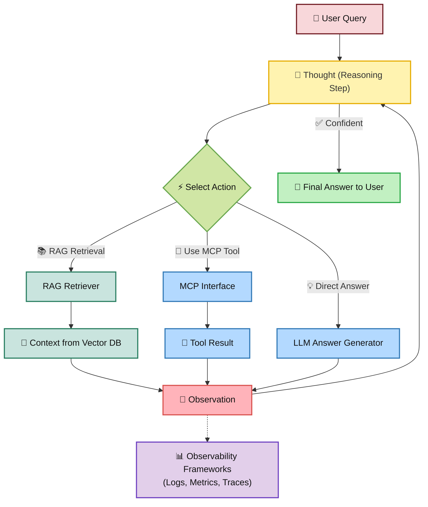

```mermaid

flowchart TD

    %% Nodes
    UQ["🧑 User Query"] --> THOUGHT["💭 Thought (Reasoning Step)"]

    THOUGHT --> ACTION{"⚡ Select Action"}
    
    ACTION -->|📚 RAG Retrieval| RAG["RAG Retriever"]
    ACTION -->|🔧 Use MCP Tool| MCP["MCP Interface"]
    ACTION -->|💡 Direct Answer| AGN["LLM Answer Generator"]

    RAG --> CTX["📂 Context from Vector DB"] --> OBS["👀 Observation"]
    MCP --> TOOL["🔎 Tool Result"] --> OBS
    AGN --> OBS

    OBS --> THOUGHT["💭 Thought (Reasoning Step)"]
    OBS -.-> OBSLOG["📊 Observability Frameworks\n(Logs, Metrics, Traces)"]

    THOUGHT -->|✅ Confident| OUT["📝 Final Answer to User"]

    %% Styles
    classDef thought fill:#fff3b0,stroke:#e6ac00,stroke-width:2px,color:#333;
    classDef action fill:#d0e6a5,stroke:#6aa84f,stroke-width:2px,color:#111;
    classDef obs fill:#ffb3ba,stroke:#d9534f,stroke-width:2px,color:#111;
    classDef tool fill:#b3d9ff,stroke:#337ab7,stroke-width:2px,color:#111;
    classDef rag fill:#c9e4de,stroke:#2a7f62,stroke-width:2px,color:#111;
    classDef obslog fill:#e2cfea,stroke:#6f42c1,stroke-width:2px,color:#111;
    classDef final fill:#c2f0c2,stroke:#28a745,stroke-width:2px,color:#111;
    classDef user fill:#f8d7da,stroke:#721c24,stroke-width:2px,color:#111;

    %% Assign classes
    UQ:::user
    THOUGHT:::thought
    ACTION:::action
    RAG:::rag
    MCP:::tool
    CTX:::rag
    TOOL:::tool
    OBS:::obs
    OBSLOG:::obslog
    OUT:::final
    AGN:::tool


```