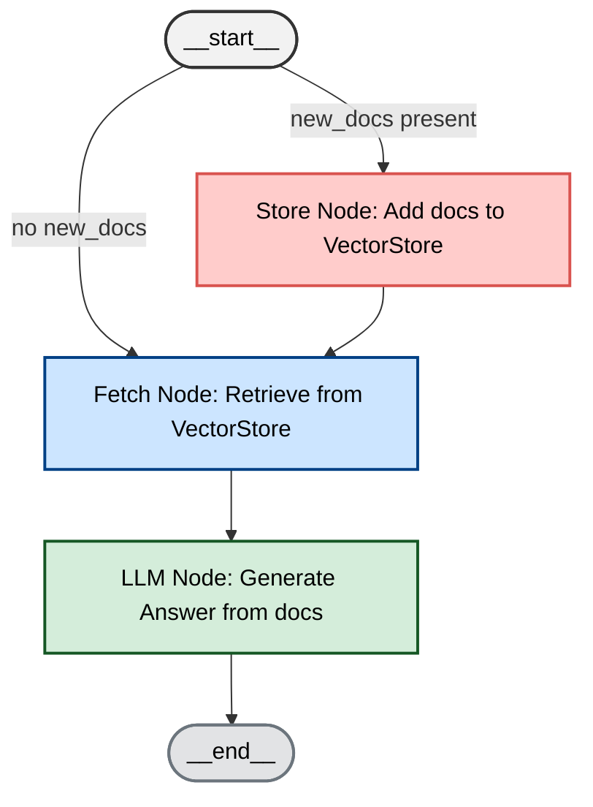

```mermaid
flowchart TD
    %% Start Node
    START(["__start__"]):::startStyle

    %% Conditional Branch
    START -->|new_docs present| STORE[Store Node: Add docs to VectorStore]:::storeStyle
    START -->|no new_docs| FETCH[Fetch Node: Retrieve from VectorStore]:::fetchStyle

    %% Fetch Node always runs after Store
    STORE --> FETCH

    %% LLM Node
    FETCH --> LLM[LLM Node: Generate Answer from docs]:::llmStyle

    %% End Node
    LLM --> END(["__end__"]):::endStyle

    %% Styling
    classDef startStyle fill:#f2f2f2,stroke:#333,stroke-width:2px,color:#000;
    classDef storeStyle fill:#ffcccb,stroke:#d9534f,stroke-width:2px,color:#000;
    classDef fetchStyle fill:#cce5ff,stroke:#004085,stroke-width:2px,color:#000;
    classDef llmStyle fill:#d4edda,stroke:#155724,stroke-width:2px,color:#000;
    classDef endStyle fill:#e2e3e5,stroke:#6c757d,stroke-width:2px,color:#000;
```